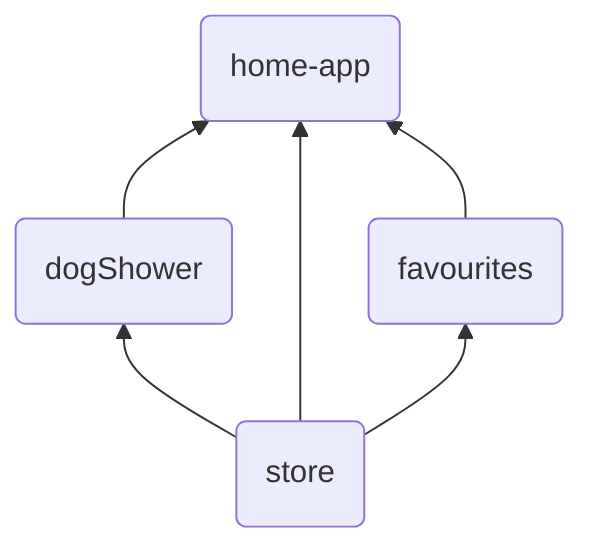

# Microfrontends with module federation

## Getting Started
`cd` to each project and run `npm install` and `npm start` to start the each project.
Open [http://localhost:3000](http://localhost:3000) to view it in the browser.

## Composition

`home-app` is a container app that loads the other apps.

## Ports
| App        | Port    |
| --------   | ------- |
| home-app   | 3000    |
| dogShower  | 3001    |
| store      | 3002    |
| favourites | 3003    |

## Thoughts

	1. Local development? 
		a. Running a MF separatly doesn't count store or styling in the shell-app
		b. Running all aps is not easy
		c. Running i home app won't make hot reload
		d. If something fails, difficult to understand what
	2. Think about styles
		a. Common styles, where should it be placed?
			i. In home-app, but then remote apps doesn't have styling
			ii. Shared common library?
		b. Styles interfering -> use css modules
		c. Pass classname to MF, så home app can style externally
	3. Why should I have StoreProvide around home-app?
        a. Ok around home. But why around each MF? - so it works separately