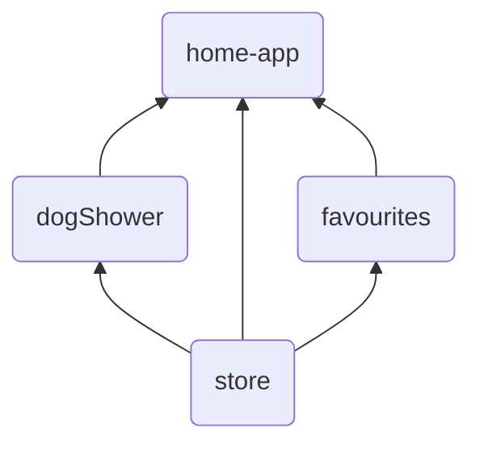

# Microfrontends with module federation

## Getting Started
`cd` to each project and run `npm install` and `npm start` to start the each project.
Open [http://localhost:3000](http://localhost:3000) to view it in the browser.

## Composition

`home-app` is a container app that loads the other apps.

## Ports
| App        | Port    |
| --------   | ------- |
| home-app   | 3000    |
| dogShower  | 3001    |
| store      | 3002    |
| favourites | 3003    |
